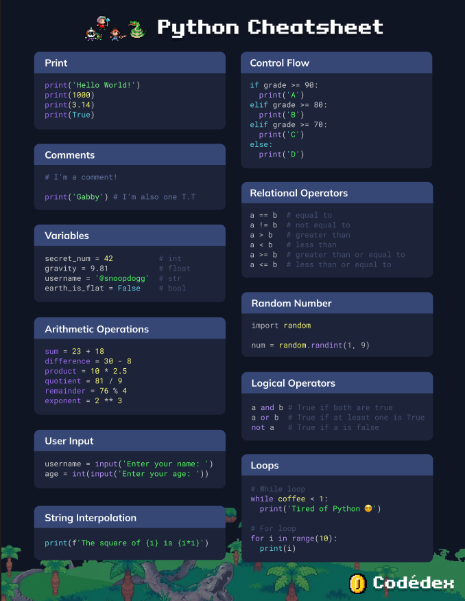

# Codédex - Python

## 1. Hello World

### Learn how to write your first line of Python by printing messages to the terminal.

Python was created by **Guido van Rossum** in the early 90s.

Python is designed to be easy to read.

Python is used in the following areas:

- Data analysis & visualization
- Artificial Intelligence (AI)
- Machine Learning (ML)
- Web development
- And much more

The extension of a Python files is **.py**

In Python, the `print()` function is used to tell a computer to "talk".
The message we want to display should be inside the parentheses and sorrounded by quotes. They can be double quotes `"` or single quotes `'`, but the opening and closing quotes marks have to be same.

Python is one line at a time, from top to bottom.

In Python we can create a comment using the `#` hashtag symbol.

Example:
`# Printing out a message`
`print('Hi')`

`print('Hi') # Printing out a message`

As a result, everything to the right of the hashtag `#` is ignored.

---

## 2. Variables

### Create variables and learn about data types, arithmetic operators, and user input.

In programming, variables are used to for storing data values.

The variable name can consist of letters, numbers, and the `_` underscore.

Example of valid variable names and values:

```
name = 'Erlich Bachman'
user_id = 16180339887
progress = 0.75
xp = 60
verified = True
```

The `=` equal sign means assignment.

We can also change the value of a variable or print it out:

```
xp = 70
xp = 80

print(xp) # Output: 80
```

#### Data types

##### Integer

An integer, or `int`, is a whole number. It has no decimal point and contains the number 0, positive and negative counting numbers.

```
year = 2023
age = 32
```

##### Float

A floating-point number, or a `float`, is a decimal number. It can be used to represent fractions or precise measurements.

```
pi = 3.14159
meal_cost = 12.99
```

##### String

A string, or `str`, is used for storing text. Strings are wrapped in double quotes `""` or single quotes `''`

```
message = "good nite"
username = '@snoopdogg'
```

##### Boolean

A boolean data type, or bool, stores a value that can only be either `true` or `false`. In Python, it's capitalized `True` or `False`. It's named after the British mathematician George Boole (1815-1864).

```
late_to_class = False
cranky = True
```

##### Arithmetics Operators

Python has the following arithmetic operators:

- `+` Addition
- `-` Subtraction
- `*` Multiplication
- `/` Division

Example:

```
score = 0           # score is 0
score = 4 + 3       # score is now 7
score = 4 - 3       # score is now 1
score = 4 * 3       # score is now 12
score = 4 / 3       # score is now 1.3333

print(score)        # Output: 1.**3333**
```

Example of coding with Parentheses:

```
tip = (pizza + coke) * 0.2
```

In Python, parentheses have the highest order of operations.

##### Modulo

The `%` modulo operator doesn't give you the result of a division - gives you the _remainder_.

```
score = 5 % 3       # score is 2
score = 5 % 2       # score is now 1
score = 5 % 1       # score is now 0
```

##### Exponents

Python can also perform exponentation such as $2^3$ or $10^2$.

Python uses the notation `**`.

So `2**3` is $2^3$ and `10**2` is $10^2$.

```
score = 2 ** 2      # score is 4
score = 2 ** 3      # score is now 8
score = 2 ** 4      # score is now 16

print(score)        # Output: 16
```

##### User input

Python uses the `input()` function to get the user input:

```
username = input('Enter your name: ')

print(username)
```

By default, the user input is stored as a text string.

If we want to save an input for the user input, we would need to wrap an `int()` around the `input()` to convert the text string into a number.

```
age = int(input('What is your age? '))

print(age)
```

##### Python errors

###### SyntaxError

Occurs when invalid Python code is present.
Example:

```
print(Hello, World!

# SyntaxError: invalid syntax
```

###### NameError

Occurs when you're trying to use a variable without declaring it first.
Example:

```
print(greetings)

# NameError: name 'greetings' is not defined
```

###### TypeError

Occurs when the data type you're using doesn't suit what you're trying to do.
Example:

```
message = 'The air quality is '
print(message + 28)

# TypeError: can only concatenate str (not "int") to str
```

---

## 3. Control Flow

### Explore how programs "make decisions" with if/else statements, relational operators, _and_ logical operators.

#### If statement

An `if` statement is used to test a condition for truth:

- If the condition evaluates to `True`, code in the `if` part is executed.
- If the condition evaluates to `False`, code is skipped.

Syntax

```
if condition:
     # code
```

Note: the code inside the `if` statement must be indented.

#### Else

An `else` clause can be optionally added to an `if` statement.

- If the condition evaluates to `True`, code in the `if` part is executed
- If the condition evaluates to `False`, code in the `else` part is executed

Example

```
if grade > 60:
     print('You passed.')
else:
     print('You failed.')
```

Note: the code inside the `else` clause must also be indented.

#### Relational operators

A lot of the times inside conditions, we are comparing two values. To do so, we need to use the Relational Operators:

- `==` equal to (Igual que)
- `!=` not equal to (Distinto de)
- `>` greater than (Mayor que)
- `<` less than (Menor que)
- `>=` greater than or equal to (Mayor o igual que)
- `<=` less than or equal to (Menor o igual que)

#### Elif

One or more `elif` statements can be optionally added in beetwen the `if` and `else` to provide additional condition(s) to check. Sometime two is simply not enough.

Example

```
if grade > 90:
  print('A')
elif grade > 80:
  print('B')
elif grade > 70:
  print('C')
elif grade > 60:
  print('D')
else:
  print('F')
```

Note: Only one of these options will execute.

#### Random

The Python standard library contains well over 200 modules that we can use.

```
import random
```

Like `random`

#### Logical Operators

Logical Operators, also known as Boolean operators, combine and evaluate two conditions.

- Operator `and`: returns `True` if both conditions are `True`, and returns `False` otherwise.
- Operator `or`: returns `True` if at least one of the conditions is `True`, and `False` otherwise.
- Operator `not`: returns `True` if the condition is `False`, and viceversa.

`and` and `or` are awfully similar. So, this is a useful table.


#### Nested If Statements

A nested `if` statement is an `if` statement _inside_ another `if` statement.

Example

```
if age >= 18:
  if income >= 20000:
    print('You are eligible for a loan.')
  else:
    print('Your income is too low to be eligible for a loan.')
else:
  print('You are too young to apply for a loan.')
```

---

## 4. Loops

### Repeat a block of code with while loops and for loops over, and over, and over again.

In programming, a **loop** is used to repeat a block of code until a specified condition is satisfied.

The `while` loop will continue to execute the code inside of it, over and over again, as long as the condition is `True`.

```
while condition:
  # code inside
```

To loop through a set of code a specified number of times, we can use a `for` loop and the `range()` function.

Syntax

```
range(start, stop, step)
```

- start: **Optional**. An integer number specifying at which position to start. Default is 0
- stop: **Required**. An integer number specifying at which position to stop (not included).
- step: **Optional**. An integer number specifying the incrementation. Default is 1

Example

```
for i in range(6)
    print(i)
```

#### String interpolation

Is a process of substituting values of variables into placeholder in a string.

Example

```
for i in range(5):
    print(f'The square of {i} is {i*i}')
```

Notice the `f` prefix before the quotes.

Another Example

```
x = range(3, 20, 2)
for i in x:
    print(i)
```



#### Nested Loops
A nested loop is a loop with another loop inside.

Example
~~~
for i in range(1, 6):
  for j in range(1, 6):
    print(i * j)
~~~

Example more complex
~~~
import random

lucky_number = random.randint(1, 9)
not_found = True

while not_found:
  for i in range(1, 10):
    if i == lucky_number:
      not_found = False
      break
    else:
      print(i)

print(f"Yay I got my lucky number {lucky_number}! 🍀")
~~~

---


